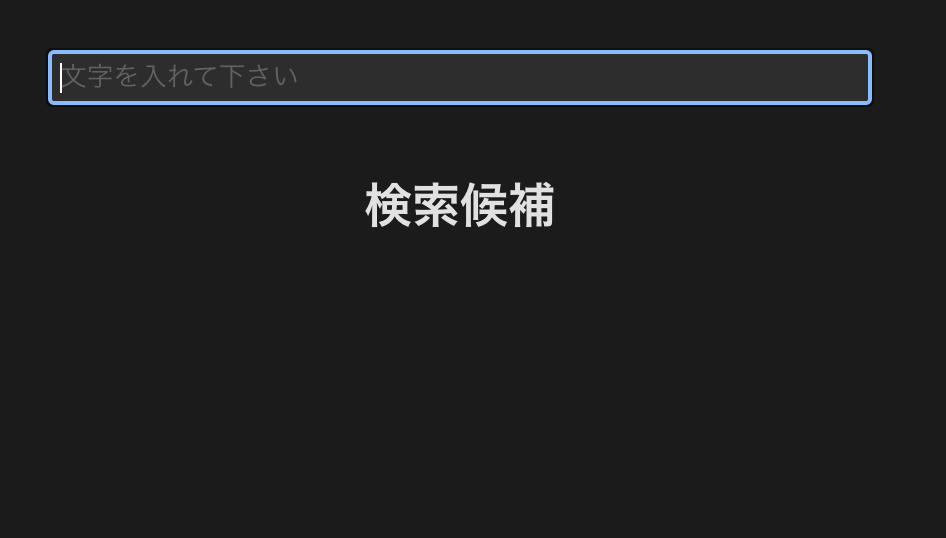
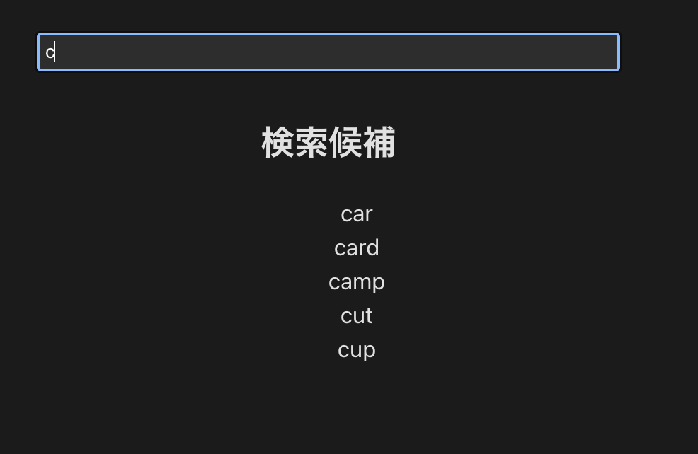
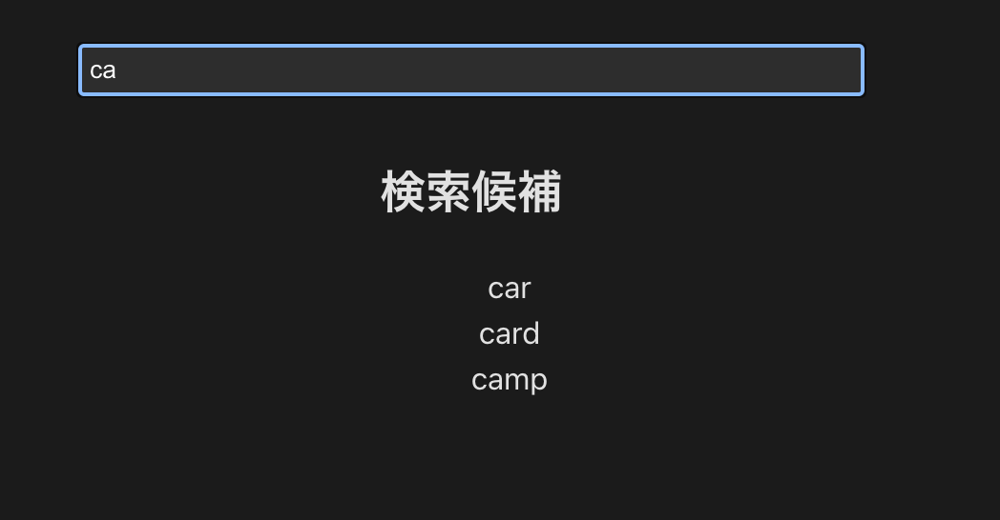
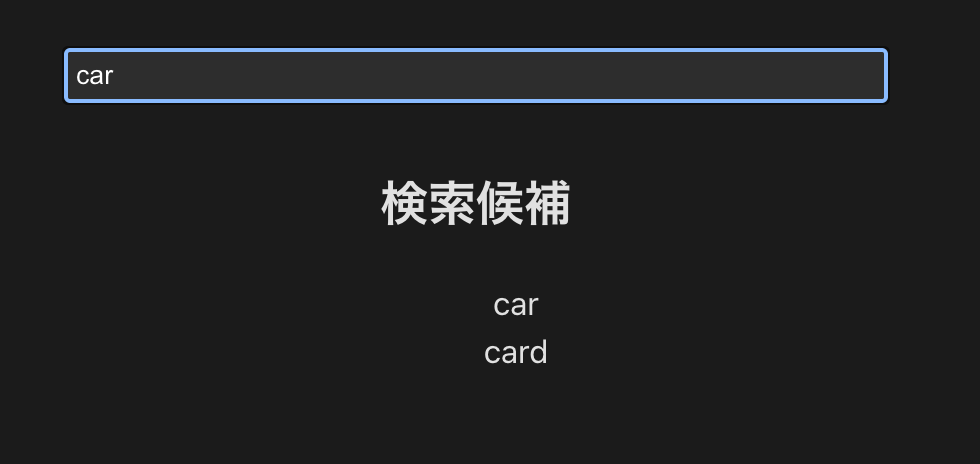

# サジェスト機能の実装

このプロジェクトは、Reactを使用してサジェスト機能を実装する方法を示しています。サジェスト機能にはTrieというデータ構造を使用して実現しています。Trie構造についてわかりやすく説明しているqiitaの記事があるので、URLを貼っておきます。

https://qiita.com/minaminao/items/caf6d8147c7e70b6ae63

最初に、どのようなものを作ったのかを説明しておきます。Trie構造やReactのコードのファイルは下に貼っておきます。ここでは具体例として、["car", "card", "camp", "cut", "cup", "date"]この配列を、trie構造に既にinsertしているとしましょう。そうすると、ユーザーがinputの箇所に「c」と打ったら、cから始まる英単語(「car」と「card」と「camp」と「cut」)だけをサジェスト候補として表示するようにして、もし「ca」と打ったら、caから始まる英単語(「car」と「card」と「camp」)だけをサジェスト候補として表示するようにし、もし、「car」と打ったら、carで始まる英単語(carとcard)だけをサジェスト候補として表示するようにします。以下がその画像です。


1. まず、以下は入力欄に何も入力されていない場合の画像です。何も入力していないので、サジェスト候補には何も表示されません



2. 次に「c」と入力した場合に表示されるサジェスト候補です。上に書いた配列の文字列の中の、cから始まる英単語が表示されています。



3. 次に「ca」と入力した場合に表示されるサジェスト候補です。caから始まる英単語が表示されています。



4. 次に「car」と入力した場合に表示されるサジェスト候補です。carから始まる英単語が表示されています。



では、Trie構造の構造を作るファイルを作っておきます。以下が、そのコードです。
```
class TrieNode {
  children: Map<string, TrieNode>;
  isEndOfWord: boolean;

  constructor() {
    this.children = new Map<string, TrieNode>();
    this.isEndOfWord = false;
  }
}

class Trie {
  private root: TrieNode;

  constructor() {
    this.root = new TrieNode();
  }

  insert(word: string): void {
    let node = this.root;
    for (let i = 0; i < word.length; i++) {
      const char = word[i];
      if (!node.children.has(char)) {
        node.children.set(char, new TrieNode());
      }
      node = node.children.get(char)!;
    }
    node.isEndOfWord = true;
  }

  search(word: string): boolean {
    let node = this.root;
    for (let i = 0; i < word.length; i++) {
      const char = word[i];
      if (!node.children.has(char)) {
        return false;
      }
      node = node.children.get(char)!;
    }
    return node.isEndOfWord;
  }

  startsWith(prefix: string): string[] {
    let node = this.root;
    for (let i = 0; i < prefix.length; i++) {
      const char = prefix[i];
      if (!node.children.has(char)) {
        return [];
      }
      node = node.children.get(char)!;
    }
    return this._getWordsFromNode(node, prefix);
  }

  private _getWordsFromNode(node: TrieNode, prefix: string): string[] {
    let suggestions: string[] = [];
    if (node.isEndOfWord) {
      suggestions.push(prefix);
    }
    node.children.forEach((childNode, char) => {
      suggestions = suggestions.concat(this._getWordsFromNode(childNode, prefix + char));
    });
    return suggestions;
  }
}

export default Trie;
```

次に、React側のファイルを貼っておきます。

```
import { useState } from "react";
import Trie from "./trie-class/Trie";

const SearchWithTrie = () => {
  const [query, setQuery] = useState<string>("");

  // サジェスト候補の単語が入る配列
  const [suggestions, setSuggestions] = useState<string[]>([]);
  
  // 先に書いておいたTrieクラスをインスタンス化しておく
  const trie = new Trie();

  // 下記の配列は、サンプルのデータです。以下の中の文字列が、サジェスト候補として表示されます。
  const sampleWords = ["car", "card", "camp", "cut", "cup", "data"];
  
  // ここで、sampleWordsの配列を一つづつ展開し、その文字列を予めTrie構造にinsertしておきます。
  sampleWords.forEach((word) => trie.insert(word));

  // ユーザーがinputタグに入力するたびに、サジェスト候補として表示するべき単語を絞って、再レンダリングさせている
  const handleInputChange = (e: React.ChangeEvent<HTMLInputElement>) => {
    const value = e.target.value;
    setQuery(value);
    if (value) {
      const foundSuggestions = trie.startsWith(value);
      setSuggestions(foundSuggestions);
    } else {
      setSuggestions([]);
    }
  };

  const handleSuggestionClick = (suggestion: string) => {
    setQuery(suggestion);
    setSuggestions([]);
  };

  return (
    <div>
      <input
        type="text"
        value={query}
        onChange={handleInputChange}
        placeholder="文字を入れて下さい"
        style={{
          margin: "2rem auto",
          padding: "0.25rem",
          display: "block",
          width: "400px",
        }}
      />
      <h2 style={{ textAlign: "center" }}>検索候補</h2>
      {suggestions.length > 0 && (
        <ul style={{ listStyle: "none", textAlign: "center" }}>
          {suggestions.map((suggestion, index) => (
            <li key={index} onClick={() => handleSuggestionClick(suggestion)}>
              {suggestion}
            </li>
          ))}
        </ul>
      )}
    </div>
  );
};

export default SearchWithTrie;

```


## 余談
私が書いたtrie構造は、各オブジェクトに1文字づつ挿入していますが、各オブジェクトに複数の文字をまとめて挿入することで、メモリ使用量の削減が期待できます。これを、Patricia Treeというようです。